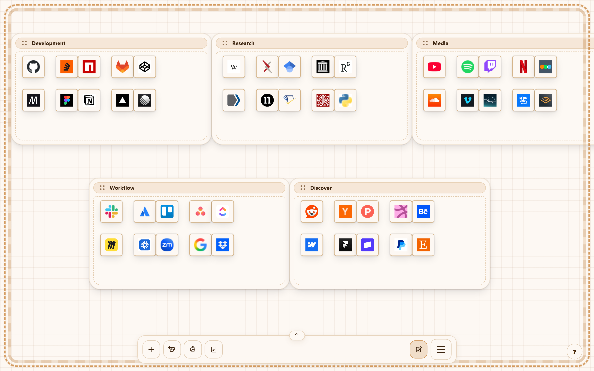
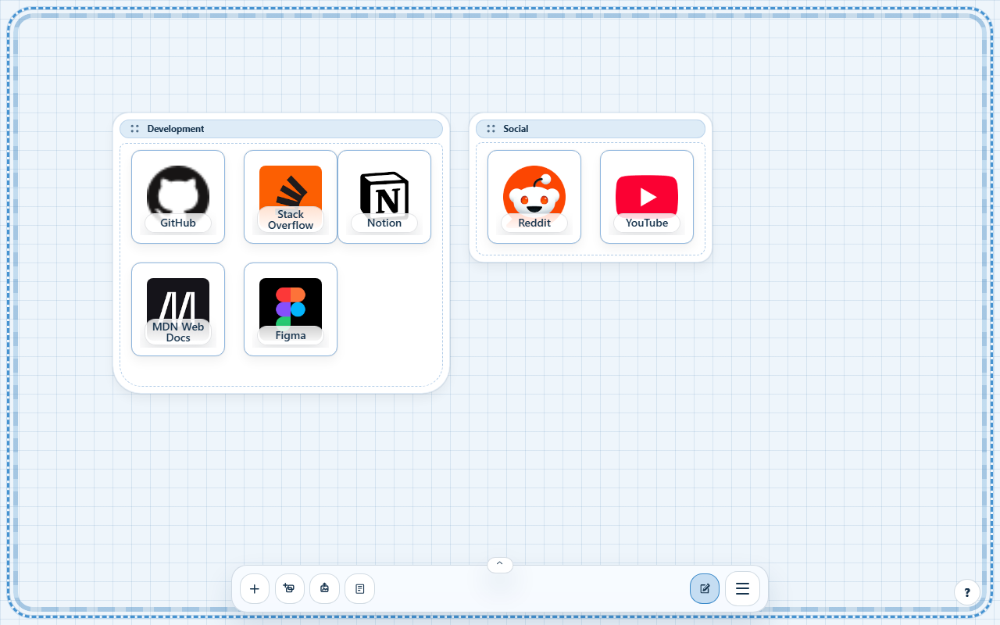
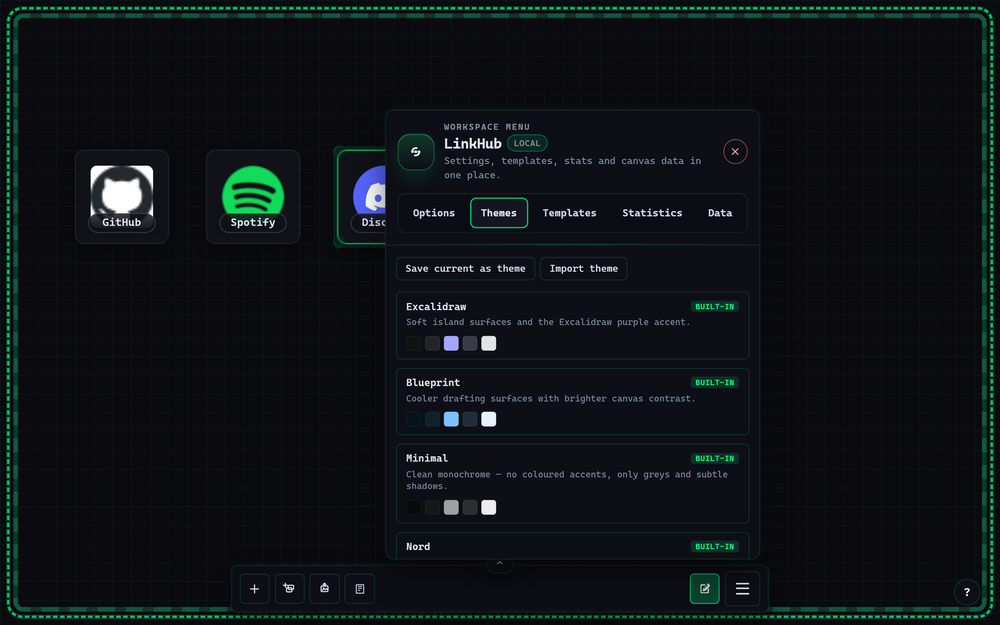
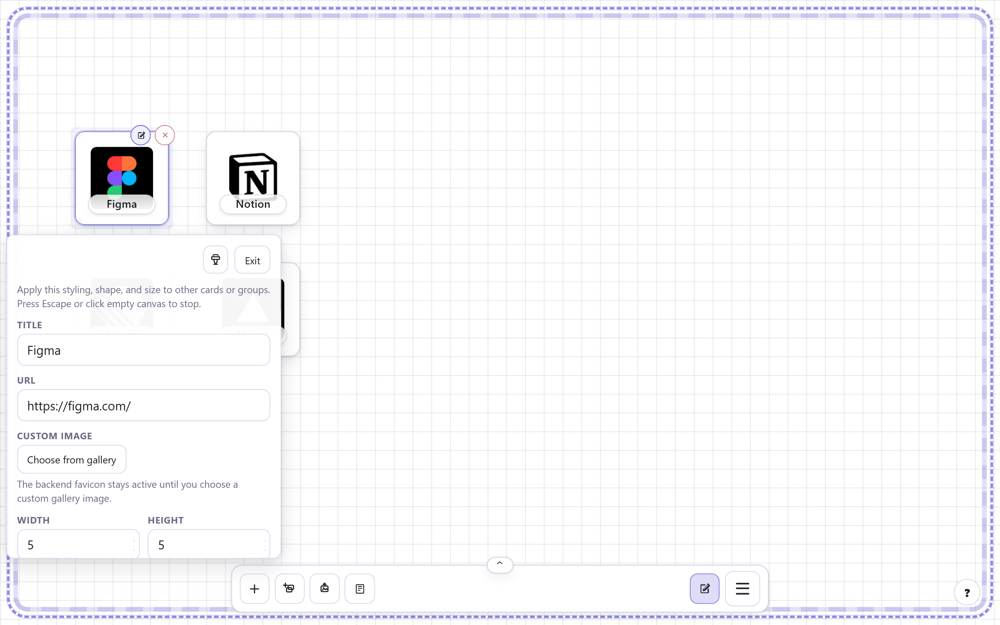
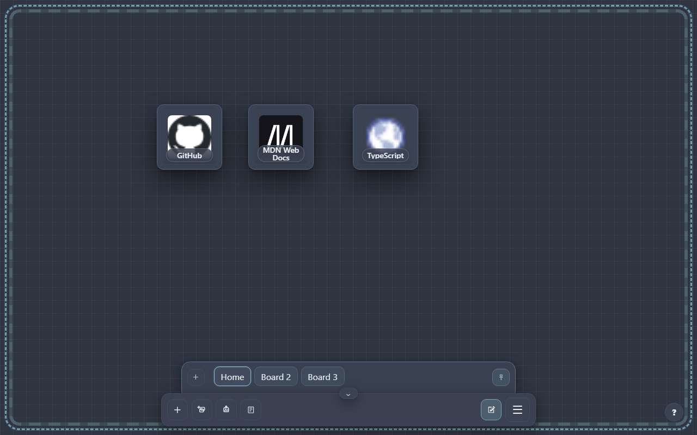
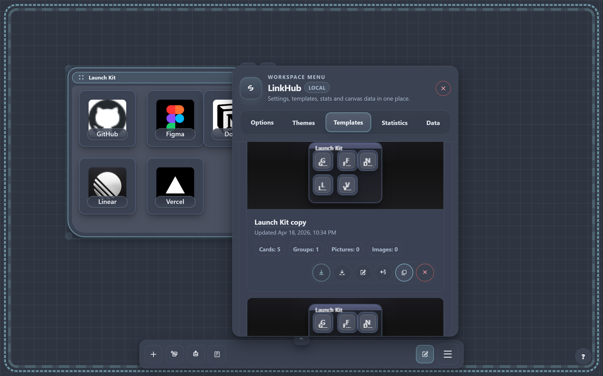

# LinkHub

LinkHub is a local-first infinite canvas for bookmarks, images, themes, and reusable layouts. It turns a blank tab into a spatial board where every link has a place, and the same React app powers both the hosted web build and the browser-extension new-tab experience for Chrome, Edge, and Firefox.



## Why LinkHub

- Infinite canvas with pan, zoom, snap-to-grid placement, marquee multi-select, copy/cut/paste, undo, and format painter
- Link cards, collapsible nested groups, and picture nodes on the same board
- Multiple workspaces with a pinned or auto-hiding workspace rail
- Six built-in themes plus saved or imported custom themes and token-level customization
- Reusable templates with preview thumbnails and bundled local images
- Local statistics for link opens, canvas opens, and storage footprint
- No account, mandatory backend, or remote sync requirement

## Feature Overview

### Canvas and editing

- Pan with right-click drag and zoom with the mouse wheel
- Snap-to-grid placement with configurable snapping behavior
- Marquee select across cards, groups, and picture nodes
- Copy, cut, paste, duplicate, and undo workspace edits
- Keyboard shortcuts and an in-app help panel for fast editing

### Content and organization

- Create link cards from URLs with automatic favicon lookup
- Resize cards from 2x2 up to 12x12 grid cells
- Override favicons with uploaded gallery images
- Organize content inside collapsible groups and nested groups
- Drop images onto the canvas as standalone picture nodes

### Themes, templates, and workspaces

- Built-in themes: Excalidraw, Blueprint, Minimal, Nord, Sunset, and Neon
- Save the current appearance as a custom theme, export it, or import `.linkhub-theme.json`
- Save selected canvas content as reusable templates with preview thumbnails
- Download template exports as `.template.json` files
- Create, rename, reorder, delete, and switch between multiple workspaces

### Data portability and local insights

- Export the current canvas as a `.linkhub.zip` bundle
- Bundle exports can include the current workspace, gallery images, saved templates, and saved custom themes
- Import can either replace the current canvas or create a new workspace
- Statistics stay local and cover card counts, group counts, link opens, canvas opens, and storage usage

## Screenshots

### Groups and layout organization



### Theme and appearance customization



### Card editing and styling controls



### Multiple workspaces



### Template library



## Quick Start

### Prerequisites

- Windows, macOS, or Linux
- Node.js 22 or later
- npm 10 or later

### Run locally

```bash
npm install
npm run dev
```

Open [http://localhost:5173](http://localhost:5173).

### Build for production

```bash
npm run build
```

## Scripts

| Command                   | Description                             |
| ------------------------- | --------------------------------------- |
| `npm run dev`             | Start the Vite development server       |
| `npm run build`           | Type-check and build the production app |
| `npm run preview`         | Preview the production build locally    |
| `npm run lint`            | Run ESLint with zero warnings allowed   |
| `npm run format`          | Format the repository with Prettier     |
| `npm run test`            | Run Vitest with coverage                |
| `npm run test:watch`      | Run Vitest in watch mode                |
| `npm run test:e2e`        | Run Playwright end-to-end tests         |
| `npm run build:extension` | Build the browser extension package     |
| `npm run deploy`          | Run the extension deployment script     |
| `npm run deploy:chrome`   | Publish only the Chrome build           |
| `npm run deploy:edge`     | Publish only the Edge build             |
| `npm run deploy:firefox`  | Publish only the Firefox build          |
| `npm run deploy:dry`      | Dry-run the extension deployment flow   |

## Browser Extension

LinkHub can be packaged as a browser-extension new-tab experience for Chrome, Edge, and Firefox.

### Build the extension

```bash
npm run build:extension
```

This creates `dist-extension/` with the bundled app, manifest, icons, and privacy page.

### Load the extension locally

Chrome and Edge:

1. Open `chrome://extensions` or `edge://extensions`
2. Enable Developer mode
3. Click Load unpacked
4. Select `dist-extension/`

Firefox:

1. Open `about:debugging#/runtime/this-firefox`
2. Click Load Temporary Add-on
3. Select `dist-extension/manifest.json`

For release workflow details, see [extension/EXTENSION.md](extension/EXTENSION.md).

## Storage and Privacy

LinkHub is local-first.

- IndexedDB is the primary persistence layer for workspaces, templates, themes, image metadata, and image blobs
- localStorage is used as a lightweight snapshot and fallback layer for workspace state and workspace-directory metadata
- Local usage insights stay on the current device and power the in-app Statistics view only
- Creating a link card requests a favicon from Google's public favicon service using the target hostname
- No account, remote sync requirement, or third-party analytics or behavioral tracking is built into the app

For deeper persistence details, see [doc/STORAGE.md](doc/STORAGE.md). The shipped privacy page lives at [public/privacy/index.html](public/privacy/index.html).

## Documentation

- [doc/README.md](doc/README.md) for the documentation index
- [doc/STORAGE.md](doc/STORAGE.md) for persistence, bundle, and migration details
- [extension/EXTENSION.md](extension/EXTENSION.md) for extension packaging and release workflow
- [extension/STORE_LISTING.md](extension/STORE_LISTING.md) for store-copy and reviewer notes
- [public/privacy/index.html](public/privacy/index.html) for the standalone privacy page
- [CONTRIBUTING.md](CONTRIBUTING.md) for contribution workflow

## Support LinkHub

If LinkHub is useful to you and you want to support more polish, testing, and store-release work, you can do that here:

- [Buy Me a Coffee](https://www.buymeacoffee.com/SchulzOli)
